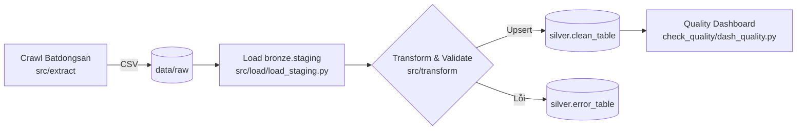

# BDS Data Pipeline

Dự án này triển khai một pipeline thu thập – làm sạch – kiểm soát chất lượng dữ liệu bất động sản Việt Nam từ nguồn `batdongsan.com.vn`. Toàn bộ dòng chảy được xây dựng bằng Python và Supabase để đảm bảo dữ liệu được gom về kho (bronze → silver), đồng thời có dashboard theo dõi chất lượng hàng ngày.

## Tổng quan kiến trúc



- **Extract**: Bộ crawler async (nodriver) mở từng main page, thu thập toàn bộ subpage rồi lưu thành CSV timestamp theo `data/raw/*.csv`.
- **Load (Bronze)**: `StagingLoader` đọc các file mới, ghi log, đẩy batch vào bảng `bronze.staging`, di chuyển file sang `data/processed/`.
- **Transform (Silver)**: `src/transform/main.py` + `Transformators` chuẩn hóa giá, diện tích, địa chỉ, pháp lý…, loại trùng, cập nhật `silver.clean_table` và log lỗi vào `silver.error_table`.
- **Quality**: `check_quality/dash_quality.py` kết nối Supabase để dựng dashboard Plotly HTML từ bảng `bronze.qc_daily_overview`.

## Cấu trúc thư mục chính

```
.
├── data/
│   ├── raw/           # CSV vừa crawl (đặt tên kèm timestamp)
│   └── processed/     # CSV đã nạp thành công
├── src/
│   ├── extract/       # Crawl config, utils, async runner
│   ├── load/          # Supabase wrapper + staging/silver loaders
│   └── transform/     # Bộ transform, validator, utilities, docs
├── check_quality/     # Script dựng dashboard chất lượng
├── requirements/      # requirements.txt
├── notebooks/         # Phân tích nhanh (test.ipynb)
└── here-to-ask.md     # Định nghĩa RPC silver.get_last_transform_date
```

## Công nghệ & thư viện chính

- **Python 3.12** (đề xuất) với `venv`.
- **nodriver** để điều khiển Chromium async, kèm cơ chế stealth và semaphore hạn chế số tab.
- **pandas / numpy / dask** cho xử lý dữ liệu hàng loạt.
- **Supabase Python client** (`supabase`, `postgrest`, `storage3`) quản lý nhiều schema (bronze, silver).
- **Plotly** phục vụ dashboard chất lượng.
- **python-dotenv** để nạp biến môi trường.

## Thiết lập môi trường

1. Cài Python 3.12 và Git.
2. Tạo virtualenv (trên Windows CMD):
   ```bat
   py -3.12 -m venv .venv
   .venv\Scripts\activate
   ```
3. Cài dependencies:
   ```bat
   pip install -r requirements\requirements.txt
   ```
4. Tạo file `.env` ở gốc dự án với các biến tối thiểu:
   ```
   SUPABASE_URL=<https://xxx.supabase.co>
   SUPABASE_KEY=<service_role_key>
   ```

## Biến môi trường & đối tượng Supabase

| Biến | Mô tả |
|------|------|
| `SUPABASE_URL` | Endpoint Supabase |
| `SUPABASE_KEY` | Service role key dùng cho ETL & dashboard |

Các bảng/hàm bắt buộc trong Supabase:

- `bronze.staging`, `bronze.qc_daily_overview`
- `silver.clean_table`, `silver.error_table`, `silver.last_transform_date`
- RPC `silver.get_last_transform_date()` (được mô tả trong `here-to-ask.md`)

## Chạy pipeline

### 1. Crawl dữ liệu
```bat
python src\extract\crawl.py
```
- Cấu hình số trang tại `src/extract/config.py` (`START_PAGE`, `END_PAGE`, `SUBPAGE_SEMAPHORE_LIMIT`).
- Kết quả CSV lưu tại `data/raw/batdongsan_raw_<timestamp>.csv`.

### 2. Đẩy file mới vào bronze.staging
```bat
python -c "from src.load.load_staging import StagingLoader; loader = StagingLoader(); print(loader.process_latest_files())"
```
- `StagingLoader` tự nhận diện file mới, chuẩn hóa `NaN`, insert/batch insert vào `bronze.staging`, log vào bảng `bronze.processed_files_log`, chuyển file sang `data/processed/` hoặc `data/error/`.

### 3. Transform & nạp silver
```bat
python src\transform\main.py
```
- Quy trình: lấy ngày cuối cùng từ RPC `silver.get_last_transform_date`, đọc dữ liệu staging mới, chạy `Transformators.transform_row`, lọc lỗi (validator + exceptions), upsert vào `silver.clean_table` (`on_conflict = subpage_url`) và ghi lỗi sang `silver.error_table`.
- Sau khi hoàn tất, `update_last_processed` cập nhật bảng `silver.last_transform_date`.
- Tài liệu chi tiết nằm trong `src/transform/documentation/documentation.md`.

### 4. Tạo dashboard chất lượng
```bat
python check_quality\dash_quality.py
```
- Script đọc bảng `bronze.qc_daily_overview`, dựng HTML `dashboard_quality.html` gồm tổng số bản ghi/ngày và biểu đồ missing value cho từng cột `missing_*`.

## Thư viện & mô-đun trọng yếu

- `SupabaseManager` (`src/load/supabase_class.py`): quản lý multi-schema client cache, hỗ trợ CRUD, batch insert, RPC.
- `StagingLoader` (`src/load/load_staging.py`): xử lý file chưa nạp, chuẩn hóa dữ liệu để tương thích JSON, batch insert, ghi log & di chuyển file.
- `Transformators` (`src/transform/transformators.py`): gồm hơn 20 hàm làm sạch (chuẩn hóa địa chỉ, diện tích, giá, pháp lý, nội thất, phân loại dự án, vv.) và `transform_row`.
- `transform/utils.py`: lấy dữ liệu mới nhất, loại trùng (`deduplicate_latest`), cập nhật `last_transform_date`.
- `check_quality/dash_quality.py`: build dashboard Plotly với tổng số bản ghi và heatmap missing data theo ngày.

## Dữ liệu và logging

- CSV mới -> `data/raw/`; sau khi nạp thành công -> `data/processed/`.
- Bảng `bronze.processed_files_log` lưu trạng thái từng file (`success/failed`) kèm `record_count`.
- Bảng `silver.error_table` giữ toàn bộ bản ghi lỗi để xử lý thủ công.
- Mỗi script sử dụng logging chuẩn `logging.basicConfig(level=logging.INFO)` (hoặc `logger = logging.getLogger(__name__)`).

## Kiểm thử & đảm bảo chất lượng

- **Kiểm tra thủ công**: chạy `StagingLoader.process_latest_files()` trên file mẫu nhỏ trước khi xử lý hàng loạt.
- **Kiểm soát thiếu dữ liệu**: dashboard highlight các cột `missing_*`.
- **Giám sát RPC**: đảm bảo `silver.get_last_transform_date` luôn trả về bản ghi mới nhất; nếu `None`, pipeline sẽ bỏ qua transform.

## Tài liệu & tham khảo nội bộ

- `src/transform/documentation/documentation.md`: mô tả đầy đủ từng trường và quy tắc chuyển đổi.
- `here-to-ask.md`: script SQL tạo RPC `silver.get_last_transform_date`.
- `notebooks/test.ipynb`: thử nghiệm/tái hiện logic transform ở chế độ notebook.

## Lộ trình & đóng góp

1. Tạo nhánh feature, cập nhật README nếu thay đổi luồng dữ liệu.
2. Chạy đủ 4 bước pipeline và dashboard trước khi mở PR.
3. Đính kèm log `processed_files_log` và snapshot dashboard để reviewer nắm chất lượng dữ liệu.

> **Mẹo**: giữ `END_PAGE` nhỏ khi thử nghiệm để tránh bị chặn IP, sau đó tăng dần khi đã xác nhận pipeline hoạt động ổn định.


